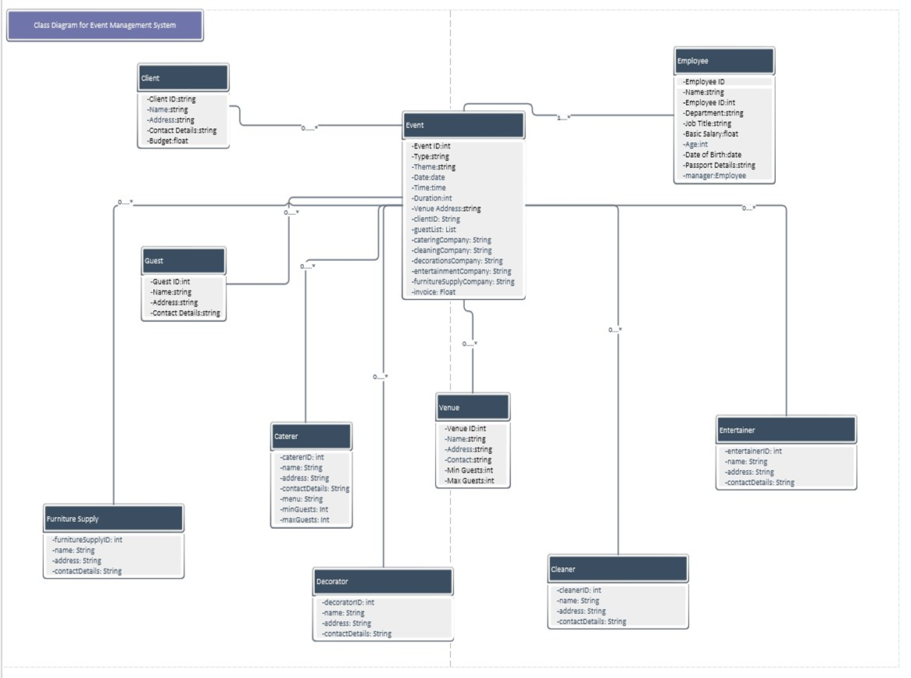

Class Diagram for Event Management System

Python Code 
        class Employee:
        def __init__(self, name, employee_id, department, job_title, basic_salary, age,   date_of_birth, passport_details, manager=None):
        self.name = name
        self.employee_id = employee_id
        self.department = department
        self.job_title = job_title
        self.basic_salary = basic_salary
        self.age = age
        self.date_of_birth = date_of_birth
        self.passport_details = passport_details
        self.manager = manager 

class EventOrganizer:
        def __init__(self):
        self.employees = []
        self.events = []
        self.clients = []
        self.guests = []
        self.venues = []
        self.caterers = []
        self.cleaners = []
        self.decorators = []
        self.entertainers = []
        self.furniture_supplies = []

    def add_employee(self, employee):
        self.employees.append(employee)

    def remove_employee(self, employee_id):
        for employee in self.employees:
            if employee.employee_id == employee_id:
                self.employees.remove(employee)
                break

Explanation:
#Employee Class Initializes the all common attributes that are in the subclasses like Salesperson, SalesManager, Marketer, MarketingManager, Accountant, Designer, and the Handyman.
Employess can Add, Delete, Modify and Display.
EventOrganizer Class implementation

GUI implementation
import tkinter as tk
class EventManagementGUI: 
def __init__(self, master): 
self.master = master master.title("Event Management System") 
self.label = tk.Label(master, text="You are in Event Management System, Welcome.") self.label.pack() 
self.button_client = tk.Button(master, text="Manage Client",command=self.manage_client 
self.button_client.pack() 
self.button_employee = tk.Button(master, text="Manage Employee",command=self.manage_employee 
self.button_employee.pack() 
# Same buttons for other functionalities 
def manage_employee(self): 
# Implement the functionality to manage employee pass 
# Initialize the Tkinter application 
root = tk.Tk() 
app = EventManagementGUI(root) 
root.mainloop()

Explanation: 
GUI components and functionality are managed by EventManagementGUI Class
In the constructor init, we initialize the main window (master) and add a label and buttons for different functionalities.
When button is clicked how the functionality work  like each button have a command associated with it, which will call a corresponding method to handle that functionality.

Store the System Data:
Pickle library used for storing data
import pickle 
# implementation of function for storage employees data 
def save_employee_data(employee): with open('employee.pkl', 'wb') as f: pickle.dump(employees, f) 
# implementation of function for loading the employees data  
def load_employee_data(): try: with open('employee.pkl', 'rb') as f: employees = pickle.load(f) return employees 
except FileNotFoundError: 
return [] 
Explanation: 
The save_employees_data function takes a list of employee objects as input and saves it to a binary file named employees.pkl.
The load_employees_data function loads data from the employees.pkl file and returns a list of employee objects. 
These functions demonstrate how to use Pickle for data serialization and deserialization.

